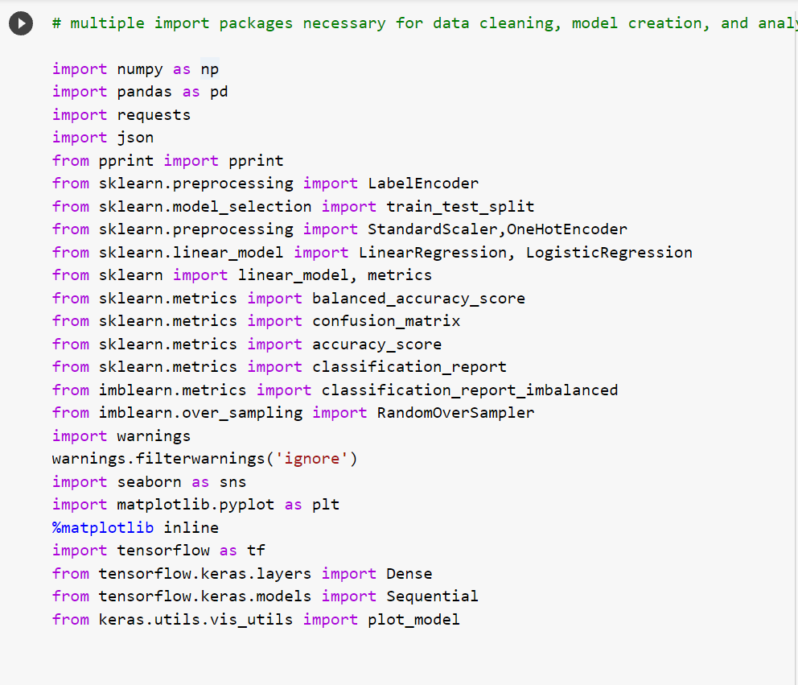
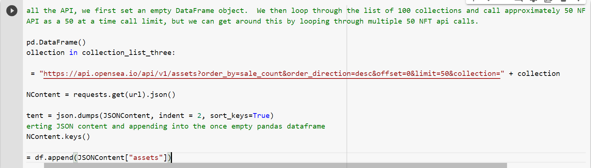
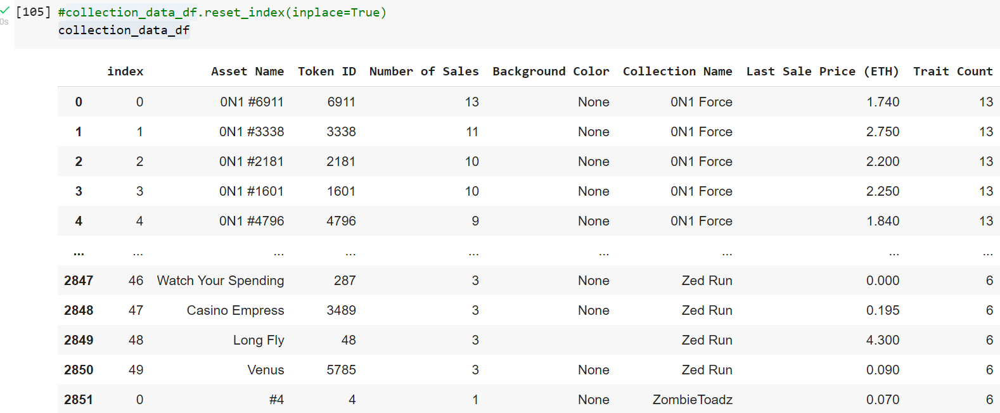
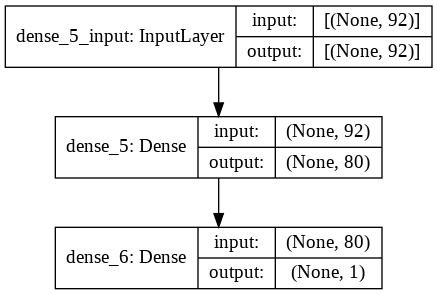
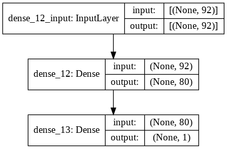

# nft-project-group8
### NFT Robopredictor Prototype

OpenSea, currently the world's largest marketplace for NFTs is an obvious source of sales information on NFTs.

The below framework makes use of the OpenSea API to construct machine learning models that can predict NFT sales outcomes. We focused on the fundamental metrics best organized by OpenSea - Collection Group, Coloring, Traits, and Sales History.

Using these values, the below framework is able to produce multiple models with consistent accuracy.

This framework can expand in future iterations to include natural language processing of NFT 'traits' and 'names' as well as image analysis for pattern recognition.

---

## Technologies
---
Built on Python, this application makes use of the OpenSea API and Google Colab iPython Notebooks. Multiple Python packages related to Machine learning are used.  They include : sklean, tensorflow, keras, LabelEncoder, OneHotEncoder, imblearn, RandomOverSampler, matplotlib, seaborn, pandas, requests, json, and numpy.

## Installation Guide
---
This project requires multiple imports of various  Python packages related to Machine learning are used.  They include : sklean, tensorflow, keras, LabelEncoder, OneHotEncoder, imblearn, RandomOverSampler, matplotlib, seaborn, pandas, requests, json, and numpy.  Though imported, they do not need to be installed when using Google colab.

---

## Examples
---
A case example of loading the API and generating a functional dataframe for modeling.

Loading the API

Cleaned Dataframe

---
## Results

Using bulleted lists, describe the balanced accuracy scores and the precision and recall scores of all machine learning models.

* Machine Learning Model Group 1:
  * Group focused on number of times and NFT sold
  * 2 of 3 submodels demonstrate competent accuracy averaging 90%
  * Prediction test holds at 92% accuracy
  

* Machine Learning Model Group 2:
  * Group focus is on Last Sale Price in Ethereum
  * 2 of 3 submodels demonstrate competent accuracy averaging 85%
  * Prediction test holds at 60% accuracy

## Summary

NFT Robopredictor tool is able to competently generate machine learning models that predict the Number of Sales and NFT can have as well as the mostly price in Ethereum.  This is done largely with a detailed categorical breakdown of NFT traits and collection relationships.

NFT Robopredictor has demonstrated to be more successful at predicting Number of Sales versus Ethereum sale price, though both are functional.

The most successful model for each subgroup has its layering described graphically below.  But were done using the most epochs.

Model 1 best model:

Model 2 best model

The most recent colab file is 'collection_data10_17_Final_group_8.ipynb' and the most recent powerpoint presentation slide deck is 'nft_robo_predictor10_17_21.pptx'.  Please review these most recent files.

---

## Contributors
---
Main contributors are finance researcher and enthusiest Charles Twitchell.  He can be found at [GitHub](https://github.com/CharlesTwitchell).  Licensed Financial Advisor Robert Giannini.  He can be found at [GitHub](https://github.com/RJGiannini).  Wealth Manager George Kraft.  He can be found at [GitHub](https://github.com/georgekraft).  

## License
---
GPU License
